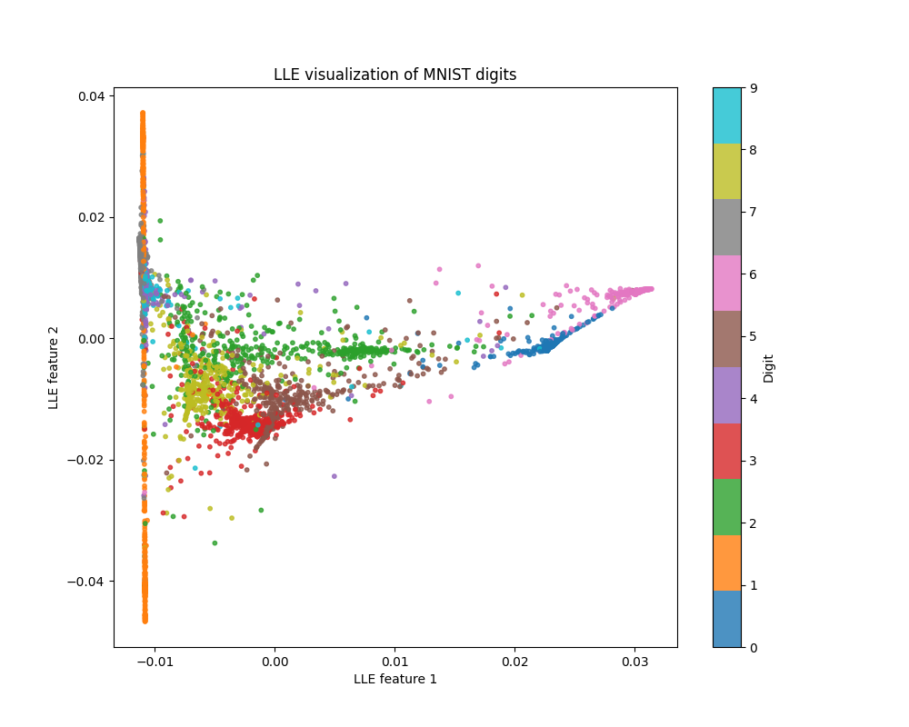

|                                                                                                                                                                                                                                                                                                                                                                                                             Question                                                                                                                                                                                                                                                                                                                                                                                                             |                                                                                                                                                                                                                                                                                                                                                                                                                                                                                                                                           Answer                                                                                                                                                                                                                                                                                                                                                                                                                                                                                                                                            |
| :------------------------------------------------------------------------------------------------------------------------------------------------------------------------------------------------------------------------------------------------------------------------------------------------------------------------------------------------------------------------------------------------------------------------------------------------------------------------------------------------------------------------------------------------------------------------------------------------------------------------------------------------------------------------------------------------------------------------------------------------------------------------------------------------------------------------------: | :-----------------------------------------------------------------------------------------------------------------------------------------------------------------------------------------------------------------------------------------------------------------------------------------------------------------------------------------------------------------------------------------------------------------------------------------------------------------------------------------------------------------------------------------------------------------------------------------------------------------------------------------------------------------------------------------------------------------------------------------------------------------------------------------------------------------------------------------------------------------------------------------------------------------------------------------------------------------------------------------------------------------------------------------------------------------------------------------: |
|                                                                                                                                                                                                                                                                                                                                                            **1. What are the main motivations for reducing a dataset's dimensionality? What are the main drawbacks?**                                                                                                                                                                                                                                                                                                                                                            |                                                                                            Many machine learning problems involve thousands or even millions of features for each training instance. Not only do all these features make training extremely slow, but they can also make it much harder to find a good solution. In real-world, it is often possible to reduce the number of features considerably, turning an intractable problem into a tractable one. Reducing dimensionality of a training set before training a model will usually speed up training. Apart from speeding-up training, dimensionality reduction is also extremely useful for data visualization. Data visualization is essential to communicate your conclusions to people who are not data scientists, in particular division makers. Reducing dimensionality does cause information loss. It is therefore recommended to train system with the original data before considering dimensionality reduction.                                                                                            |
|                                                                                                                                                                                                                                                                                                                                                                                           **2. What is the curse of dimensionality?**                                                                                                                                                                                                                                                                                                                                                                                            |                                                                                                                                            Training instances which have thousands to millions of features makes training extremely slow and makes it much harder to find a good solution. This is called the _curse of dimensionality_. For example the probablity that a random point in a unit square is less than 0.001 from a boarder in a 10_000 is alost 100%. The average distance between two random points in a 1_000_000 dimensional unit hypercube is about 408.25. There is just plenty of space in high dimensions. As a result such datasets are at risk of being very sparse: most training instances are likely to be far from each other, and the more dimensions there are, the greater will be the risk of overfitting. In high dimensions, data points tend to be equidistant, making similarity measures less meaningful.                                                                                                                                             |
|                                                                                                                                                                                                                                                                                                                                                    **3. Once a dataset's dimensionality has been reduced, is it possible to reverse the operation? If so, how? if not why?**                                                                                                                                                                                                                                                                                                                                                     |                                                                                                                                                                                                                                  It is possible to decompress the reduced dataset by applying the inverse transformation of the PCA projection. This will not give the original data, but it will likely be close to the original data. The mean squared distance between the original data and the reconstructed data is called the _reconstruction error_. To perform the inverse transform with Random Projection, one needs to compute the pseudo-inverse of the commponents matrix, then multiply the reduced data by the transpose of the pseudo-inverse. Computing the pseudo-innverse may take a very long time if the components matrix is large.                                                                                                                                                                                                                                  |
|                                                                                                                                                                                                                                                                                                                                                                        **4. Can PCA be used to reduce the dimensionality of a highly nonlinear dataset?**                                                                                                                                                                                                                                                                                                                                                                        |                                                                                                                                                                                                       PCA can be used for reducing dimensionality of nonlinear data: dimensionality (the number of features) and linearity (the geometric structure of the data) are _independent properties_. There are nuances. PCA relies on _linear subspaces_ (like a flat plane). If the true structure is curved (e.g. Swiss roll), PCA can't bend its axes to follow the curve, losing critical relationships. An exception to the rule may be considered Kernel PCA, which uses the kernel trick to map data to a _higher-dimensional space_ where it becomes linear, then applies PCA. LLE (_Locally linear embedding_) is better suitable for _nonlinear dimensionality reduction_ (NLDR).                                                                                                                                                                                                       |
|                                                                                                                                                                                                                                                                                                                                  **5. Suppose you perform PCA on a 1000-dimensional dataset, setting the explained variance ratio to 95% How many dimensions will the resulting dataset have?**                                                                                                                                                                                                                                                                                                                                  |                         The percentage of dimensions kept/dropped in PCA to retain 95% variance _is strictly determined by the data's eigenvalues_ (which depend on the data's shape/covariance structure). PCA ranks dimensions by their _explained variance_ - computed from the eigenvalues of the covariance matrix. For _flat data_ eigenvalues decay rapidly, and we may need only 1-2 components. For spherical data (eigenvalues are similar), we would probably have to retain all dimensions. Without examining the actual dataset's eigenvalue distribution, it's impossible to give an exact number. Number of preserved dimensions also depends on the type of the downstream estimator. In a transform and fit pipeline, one could use a `RandomizedSearchCV` to find a good combination of hyperparameters for both PCA and a downstream estimator (for example `n_estimators` for a `RandomForestClassifier`) Number of preserved dimensions would be bigger for `SGDClassifier` (linear model) than for a `RandomForestClassifier` in a pipeline.                          |
|                                                                                                                                                                                                                                                                                                                                                              **6. In what cases would you use regular PCA, incremental PCA, randomized PCA, or random projection?**                                                                                                                                                                                                                                                                                                                                                              |                                                                                            I would use regular PCA on a reasonably large number of dimensions, reasonablly referring to cases were using _singular value decomposition_ (SVD) factorization technique for finding principal components would not take too long. Randomized PCA is a stochastic algorithm to quickly find an approximation of the first _d_ principal components. This is dramatically faster than full SVD used by regular PCA. Finally, I would use Incremental PCA with training sets that do not fit into memory. This algorithm splits the training set into mini-batches and feeds these in one mini-batch at a time. Note that we must call the `partial_fit()` with each mini-batch. Noteworthy, PCA can become fairly slow with high-dimensional datasets. Even if you use randomized PCA the `O` complexity is square. For a dataset of 10000 features or more using random projections is recommended.                                                                                            |
|                                                                                                                                                                                                                                                                                                                                                               **7. How can you evaluate the performance of a dimensionality reduction algorithm on your dataset?**                                                                                                                                                                                                                                                                                                                                                               | The measure of efficiency of a dimensionality depends on the approach used by any given algorithm, or even on the algorithm itself. We may say that for all algorithms, speed and number / ratio of reduced dimensions are two important indicators. In addition, for PCA efficiency also depends on preserving the variance ratio. For random projections the additional indicator is the number of reduced dimensions given preserved distance between data points. For Manifold learning algorithms, specifically LLE, the efficiency is based on preserving k-nearest neighbours distance between datapoints. Besides that, if you ever need to recosntruct the original set back to the original number of dimensions, there will always be lost information, different algorithms will differ by the amount of lost information. This is being referred to as the amount of _reconstruction error_. One last extemely important KPI for evaluating different dimensionality reduction algorithms is the capacity to reduce the dimensions so that to enable clear data visualization. |
|                                                                                                                                                                                                                                                                                                                                                                    **8. Does it make any sense to chain two diffferent dimensionality reduction algorithms?**                                                                                                                                                                                                                                                                                                                                                                    |                                                                                                                                                                                                                                                                      Chaining different dimensionality reduction techniques can make sense in certain scenarios. Common use-cases would be: a) **Preprocessing**: use PCA to reduce noise and shrink dimensions, and then use `t-SNE` to handle nonlinearity in lower dimension space, b) **Combine linear and nonlinear reductions**: Use Isomap tp approximate geodesic distance, and compress the output with PCA, c) **Noise reduction**: Use an auto-encoder to reduce dimensions loosely, and then optimize the reduced space for variance retention using PCA.                                                                                                                                                                                                                                                                       |
|                                                              9. Load the MNIST dataset (introduced in Chapter 3) and split it into a training set and a test set (take the first 60,000 instances for training, and the remaining 10,000 for testing). Train a random forest classifier on the dataset and time how long it takes, then evaluate the resulting model on the test set. Next, use PCA to reduce the dataset's dimensionality, with an explained variance ratio of 95%. Train a new random forest classifier on the reduced dataset and see how long it takes. Was training much faster? Next, evaluate the classifier on the test set. How does it compare to the previous classifier? Try again with an `SGDClassifier`. How much does PCA help now?                                                              |                                                                                                                                                                                                                                                                                                                                 Check the solution [here](./ex09/main.py). It would seem that a linear classifier benefits greatly from applying PCA, whereas PCA may interfere with Random forests' feature selection. PCA also tend to transform sparse data into dense data which may negatively affect Random forests' performance. The appropriate solution for Random forests could involve a pipeline, with different hyperparameters' fine-tuning.                                                                                                                                                                                                                                                                                                                                  |
| 10. Use t-SNE to reduce the first 5000 images of the MNIST dataset down to 2 dimensions and plot the result using Matplotlib. You can use a scatterplot using 10 different colors to represent each image's target class. Alternatively, you can replace each dot in the scatterplot with the corresponding instance's class (a digit from 0 to 9), or even plot scaled-dwon versions of the digit images themselves (if you plot all digits the visualization will be too cluttered, so you should either draw a random sample or plot an instance only if no other instance has already been plotted at a close distance). You should get a nice visualization with well-separated clusters of digits. Try using other dimensionality reduction algorithms such as PCA, LLE, or MDS, and compare the resulting visualizations. |                                                                                                                                                                                                                                                                                                                                                                                    Check the solution [here](./ex10/main.py). Please see below the visualization plots for different dimensionality reducing algorithms. Only t-SNE looks "tidy" and this is entirely normal and demonstrates one of the key benefits of t-SNE - it is excellent specifically for visualization and cluster separation.                                                                                                                                                                                                                                                                                                                                                                                     |

**t-SNE**:

- t-SNE specifically tries to preserve both local and global structure while separating dissimilar points
- it excels at creating well-separated clusters
- it is purposefully designed for visualization tasks, while PCA and LLE have different primary goals

**PCA**:

- PCA is a linear technique that projects data along directions of maximum variance
- it doesn't try to separate clusters - it just preserves global variance
- the plot shows some structure (1 digit separates a bit), but the classes overlap significantly
- this is expected since handwritten digits don't vary in a simple linear way that PCA can capture

**LLE**:

- LLE focuses on preserving local relationships between neighbors
- plot demonstrates an interesting structure with some digit separation, but in an unusual triangular pattern
- digit 1 makes a strong vertical line on the left, which makes sense because it is visually distinct

**MDS**:

- it creates a distinctive circular pattern where digits are distributed in a radial fashion. This "globular" arrangment is common with MDS
- it shows some partial clustering (0s and 1s)
- different digit classes form rough concentric rings or sectors
- maintains some global structure, but doesn't achieve clear cluster separation
- there's significant overlap between classes

